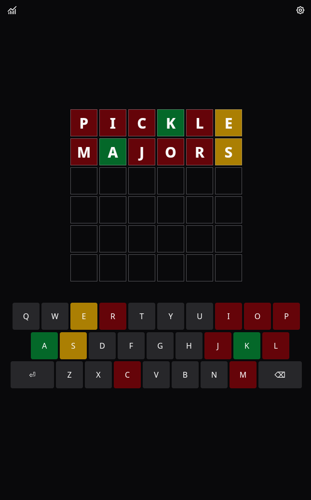
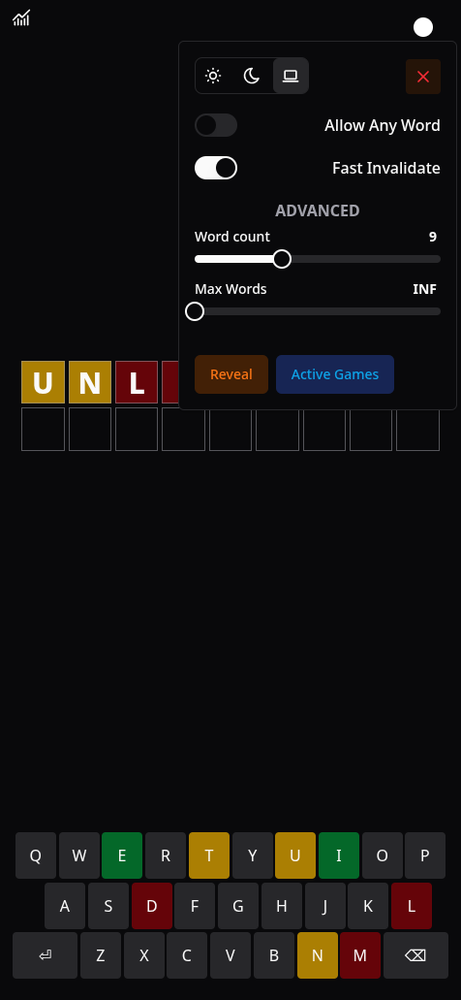
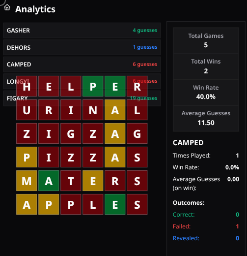
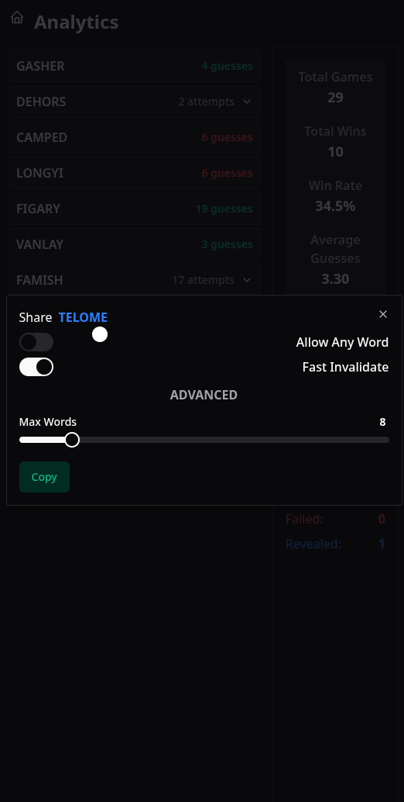

# Yet Another Wordle Clone

A simple and lightweight Wordle game clone built using [Solid.js](https://www.solidjs.com/) and TypeScript.

<!-- **[Play the Live Demo!](todo)** -->

## Features

* **No backend Required**
* **Responsive Design**
* **Customizable Word Length**
* **Customizable Max Attempts**
* **Sharing**

## Images

<table>
  <tr>
    <td>
      
    </td>
    <td>
      
    </td>
    <td>
      
    </td>
    <td>
      
    </td>
  </tr>
</table>

## Technologies Used

* [Solid.js](https://www.solidjs.com/) - A reactive JavaScript library for building user interfaces.
* [TypeScript](https://www.typescriptlang.org/) - For type safety and improved code maintainability.
* [Vite](https://vitejs.dev/) - For fast development and build tooling.
* [Tailwind CSS](https://tailwindcss.com/) - A utility-first CSS framework
* [Solid - ui](https://github.com/stefan-karger/solid-ui) - Shadcn port for solid.

## Getting Started

To run this project locally, you'll need [Node.js](https://nodejs.org/) and [npm](https://www.npmjs.com/) installed on your machine.

1. **Clone the repository:**

 ```bash
 git clone https://github.com/ItsMeSamey/game_wordle.git
 cd game_wordle
 ```

2. **Install dependencies:**

 ```bash
 npm install # or bun install
 ```

3. **Start the development server:**

 ```bash
 npm run dev # or bun dev
 ```

 This will start the Vite development server (usually at `http://localhost:5173`).

## Building for Production

To build the project for production deployment:

```bash
npm run build # or bun run build
```
This will create a production-ready build in the dist directory

## Contributing

Contributions are welcome! Feel free to fork this repository and submit pull requests with improvements or bug fixes.


